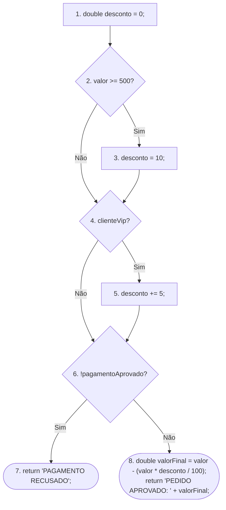

# Cálculos e lógica de resolução do ex 1

## Blocos básicos

- Nó 1: `double desconto = 0;`
- Nó 2: `if (valor >= 500)`
- Nó 3: `desconto = 10;`
- Nó 4: `if (clienteVip)`
- Nó 5: `desconto += 5;`
- Nó 6: `if (!pagamentoAprovado)`
- Nó 7: `return "PAGAMENTO RECUSADO";`
- Nó 8: `double valorFinal = valor - (valor * desconto / 100); return "PEDIDO APROVADO: " + valorFinal;`

## Decisões

- Nó 2: `valor >= 500`
- Nó 4: `clienteVip`
- Nó 6: `!pagamentoAprovado`

## Grafo de Fluxo de Controle



## Contagem de nós e arestas

N = 8

E = 9

Arestas:

1 → 2
2 → 3
2 → 4
3 → 4
4 → 5
4 → 6
5 → 6
6 → 7
6 → 8

## Complexidade ciclomática

Pela fórmula baseada nas decisões:

```text
V(G) = número de decisões + 1
V(G) = 3 + 1
V(G) = 4
```

Para utilizar:

```text
V(G) = E - N + 2
```

é necessário acrescentar um nó de saída virtual, pois o código possui dois `return` que encerram o método.

Com o nó de saída virtual:

```text
N = 9
E = 11

V(G) = 11 - 9 + 2
V(G) = 4
```

O nó de saída virtual não é um bloco básico do código. Ele serve apenas para representar um único ponto de saída no CFG.

## Questões para discussão

### Quantas combinações entre as três condições são possíveis?

Existem 3 condições booleanas:

- `valor >= 500`
- `clienteVip`
- `!pagamentoAprovado`

Cada condição pode ser `true` ou `false`.

```text
2³ = 8
```

Assim, existem 8 combinações possíveis.

### O número de combinações possíveis é igual à complexidade ciclomática? Explique.

Não, as 8 combinações representam todas as possibilidades de valores `true` e `false` para as três condições.
A complexidade ciclomática representa a quantidade de caminhos independentes no fluxo de controle.

```text
V(G) = 3 + 1 = 4
```

Assim, existem 8 combinações possíveis e 4 caminhos independentes.

### Como o `return` dentro da terceira condição altera o grafo?

O `return` cria um encerramento antecipado. Quando `!pagamentoAprovado` é verdadeiro, o fluxo segue para o nó 7 e o método termina.
Nesse caminho, o fluxo não chega ao nó 8.

### É possível executar o cálculo de `valorFinal` quando o pagamento não foi aprovado?

Não, quando `pagamentoAprovado = false`, a condição `!pagamentoAprovado` é verdadeira.
O programa executa:

```text
return "PAGAMENTO RECUSADO";
```

Assim, o método termina antes de executar o cálculo de `valorFinal`.
